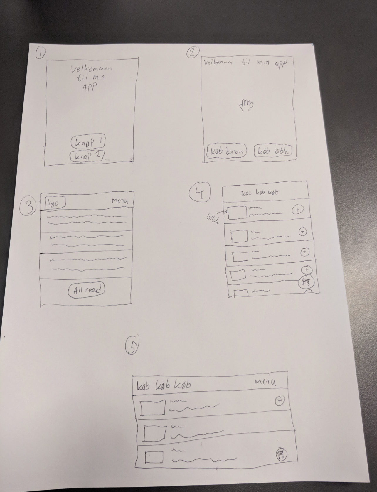

# Basic layout


## Learning goals

- `@Composable`
  - `@Preview`
- `Modifier`
- `Column`
- Multiple activities


## Preparation

- Go through [this guide](https://developer.android.com/courses/pathways/android-basics-compose-unit-1-pathway-3). The two following elements are important, the rest is optional
  - Intro to Jetpack Compose (video)
  - Build a simple app with text composables (Codelab)


## `@Composable`

`@composable` annotation informs the Compose compiler that this function is intended to convert data into UI


### `@Preview`


## `modifier`


## `Column`


## Multiple activities


### 1. Create `SecondActivity` Kotlin File

First, you need to create a new Kotlin file for your second activity:

1. In Android Studio, right-click on the `app/src/main/java/your/package/name/` directory in the Project panel.
2. Choose `New` > `Kotlin File/Class`.
3. Name the new class, e.g., `SecondActivity`, and select `File` from the kind options.


Inside the new SecondActivity write

```
package YOUR_PACKAGE_HERE

import android.os.Bundle
import androidx.activity.ComponentActivity
import androidx.activity.compose.setContent
import androidx.compose.material3.Text

class SecondActivity : ComponentActivity() {
    override fun onCreate(savedInstanceState: Bundle?) {
        super.onCreate(savedInstanceState)
        setContent {
            Text(text = "lol")
        }
    }
}
```

`YOUR_PACKAGE_HERE` could fx be `com.example.basiclayoutexercisesolutions`


### 2. Add the activity to the `manifests/AndroidManifest.xml` file

After the main activity add the following:

```xml
<activity android:name=".SecondActivity" />
```


### 3. Navigate to the activity

In your `MainActivity.kt`

Add the following code:

```kotlin
Button(onClick = {
    val intent = Intent(this, SecondActivity::class.java);
    startActivity(intent);
}) {
    Text(text = "navigate to other Activity")
}
```

This code adds a button that when clicked navigates to the new activity


## Exercises


### Layout

Recreate the following layouts



For this exercise you will need to do some research. Fx how to add an image, how column and rows work, etc. 


### Confetti app 🎉

Let's create an app that shows confetti when clicking on a button


#### Install the confetti module

Read about the Konfetti library [here](https://github.com/DanielMartinus/Konfetti)

In the `build.gradle` file, add `implementation 'nl.dionsegijn:konfetti-xml:2.0.2'` to the `dependencies {}` part

Now press `Sync Now` in the top to download and install the library

> This is like `npm install` for Java! The `build.gradle` is like the `package.json` file!


#### Add a confetti view to our `activity_main.xml`

Add this code to the `activity_main.xml` view. This will add a `KonfettiView` where konfetti will be drawn

```xml
<nl.dionsegijn.konfetti.xml.KonfettiView
    android:id="@+id/konfettiView"
    android:layout_width="match_parent"
    android:layout_height="match_parent"
    app:layout_constraintBottom_toBottomOf="parent"
    app:layout_constraintLeft_toLeftOf="parent"
    app:layout_constraintRight_toRightOf="parent"
    app:layout_constraintTop_toTopOf="parent" />
```


#### Create the boilerplate code

In the `MainActivity.java` add this code:

```java
public class MainActivity extends AppCompatActivity {
    private KonfettiView konfettiView = null;
    private Shape.DrawableShape drawableShape = null;
    private Party party = null;

    @Override
    protected void onCreate(Bundle savedInstanceState) {
        super.onCreate(savedInstanceState);
        setContentView(R.layout.activity_main);
        konfettiView = findViewById(R.id.konfettiView);

        EmitterConfig emitterConfig = new Emitter(200, TimeUnit.MILLISECONDS).perSecond(50);
        party = new PartyFactory(emitterConfig)
                .spread(360)
                .colors(Arrays.asList(0xfce18a, 0xff726d, 0xf4306d, 0xb48def))
                .setSpeedBetween(0f, 30f)
                .position(new Position.Relative(0.5, 0.3))
                .build();
    }
}
```


#### 🎉🎉🎉🎉🎉🎉

To actually start the confetti use this code

```java
konfettiView.start(party);
```


#### 📝 One button

Create a button that when clicked will start showing confetti


#### 📝 Two buttons

Create two buttons. When one button is clicked is should show short burts of confetti. For the other button is should show a long burst of confetti


#### 📝 Confetti where clicked

Make is possible so that where the user clicks there will be confetti. Maybe this mode could be activated with a slider.


#### 📝 Keep holding the button

Create a button that will spew confettit as long as the button is pressed!


#### Create a fart button 💨

When clicking a button a fart sound should be played

