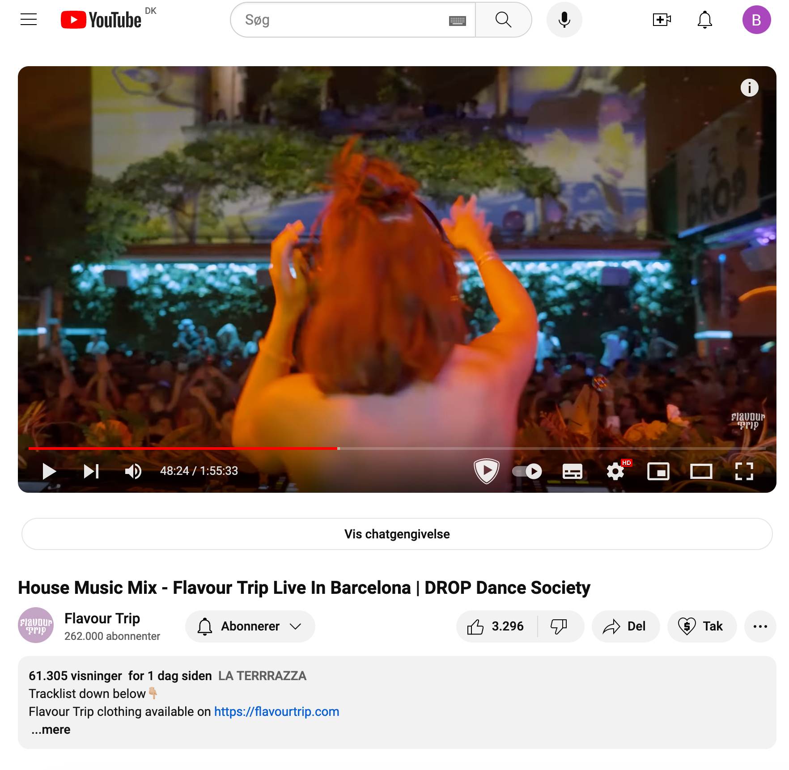
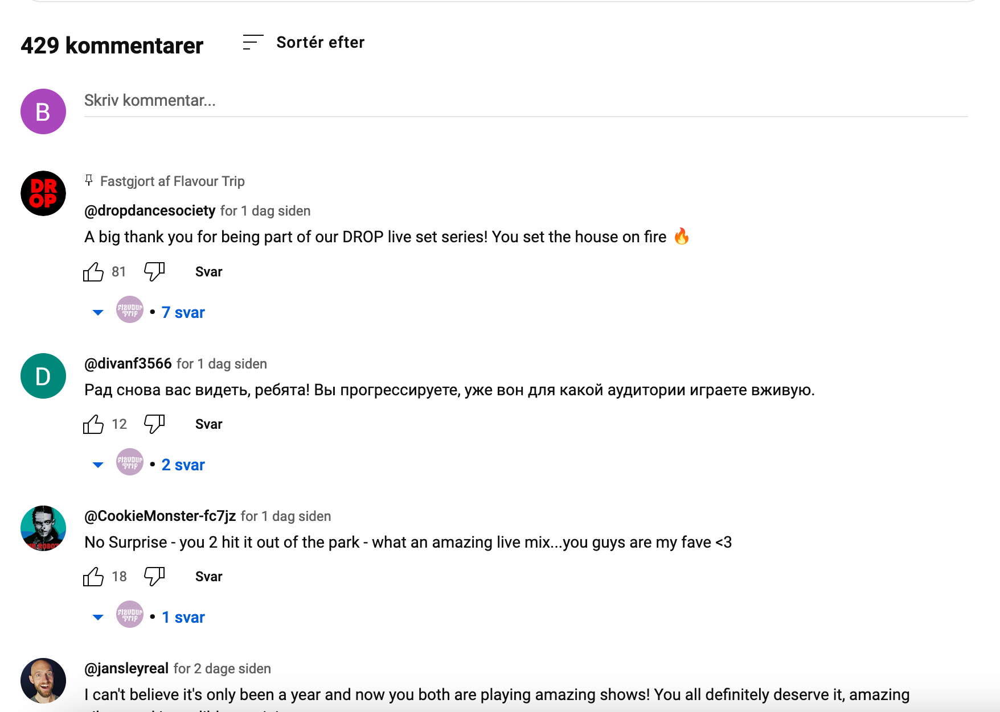

# Lists & Multiple activities

This is a bit too overkill i think: [Add a scrollable list](https://developer.android.com/codelabs/basic-android-kotlin-compose-training-add-scrollable-list?continue=https%3A%2F%2Fdeveloper.android.com%2Fcourses%2Fpathways%2Fandroid-basics-compose-unit-3-pathway-2%23codelab-https%3A%2F%2Fdeveloper.android.com%2Fcodelabs%2Fbasic-android-kotlin-compose-training-add-scrollable-list#1)


## Learning goals

- Recap of state
- Lists `LazyColumn` vs `Column`
- Multiple activities


## `LazyColumn`

We can just use a column, but no recycler behavior (only rendering items on screen)


```kotlin
LazyColumn (
    modifier = Modifier
        .height(height = 70.dp)
){
    items(10) { i ->
        androidx.compose.material3.Icon(
            imageVector = Icons.Default.Settings,
            contentDescription = null
        )
    }
}
```


Iterate a list

```kotlin
@Composable
fun SendArgumentsHere(name: String, users: List<String>) {
    Text(text = name)
    LazyColumn() {
        items(users) { name ->
            Text(text = name)
        }
    }
}
```


### MutableStateListOf


### Using the key in the list


/**
             * Use key param to define unique keys representing the items in a mutable list,
                          * instead of using the default key (list position). This prevents unnecessary
                          * recompositions.
                                       */
                        ​            key = { task -> task.id }


<!--

## Multiple activities


### 1. Create `SecondActivity` Kotlin File

First, you need to create a new Kotlin file for your second activity:

1. In Android Studio, right-click on the `app/src/main/java/your/package/name/` directory in the Project panel.
2. Choose `New` > `Kotlin File/Class`.
3. Name the new class, e.g., `SecondActivity`, and select `File` from the kind options.


Inside the new SecondActivity write

```kotlin
package YOUR_PACKAGE_HERE

import android.os.Bundle
import androidx.activity.ComponentActivity
import androidx.activity.compose.setContent
import androidx.compose.material3.Text

class SecondActivity : ComponentActivity() {
    override fun onCreate(savedInstanceState: Bundle?) {
        super.onCreate(savedInstanceState)
        setContent {
            Text(text = "lol")
        }
    }
}
```

`YOUR_PACKAGE_HERE` could fx be `com.example.basiclayoutexercisesolutions`


### 2. Add the activity to the `manifests/AndroidManifest.xml` file

After the main activity add the following:

```xml
<activity android:name=".SecondActivity" />
```


### 3. Navigate to the activity

In your `MainActivity.kt`

Add the following code:

```kotlin
Button(onClick = {
    val intent = Intent(this@MainActivity, SecondActivity::class.java);
    startActivity(intent);
}) {
    Text(text = "navigate to other Activity")
}
```

This code adds a button that when clicked navigates to the new activity

-->


## Exercise

Jeg skal lave en nemmere opgave her først


## Case - Youtube Viewer clone

You can continue last times case with the timer or create a new app: Youtube viewer clone








There are lots of features that could be created here:

- The like or dislike button
- You can expand the description
- You can subscribe to a Youtuber
- There is a comment section where users can add comments and sort them
- Each comment can be liked


There are **tons** of things to work on but remember to focus! Create the bare minimum layout first and then start working on state

