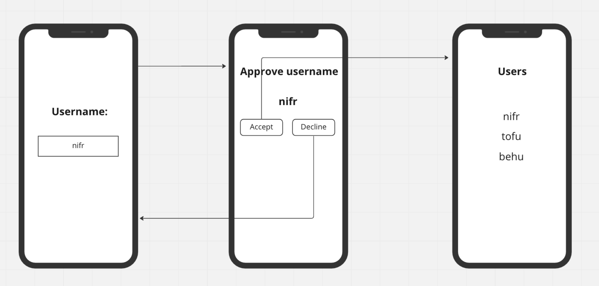
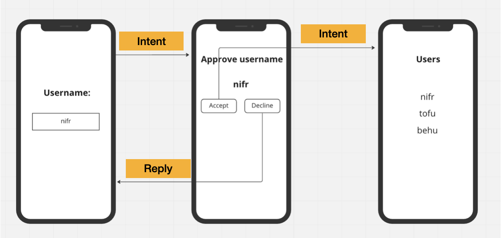

# Intents

Optional boilerplate: [Github](https://nicklasdean.gitbook.io/ita22-2-sem/applikationsudvikling/activities-intents)

Google Training: [Google](https://developer.android.com/codelabs/android-training-create-an-activity?index=..%2F..%2Fandroid-training#0)

#### Target wireframe:






**This exercise mainly concerns functionality - it is not important to style the application**


#### 📝 A)

Create functionality such that a user is able to send string data from one intent to another.

A user should be able to enter a username, press a "submit" button and be redirected to a new Activity that displays the username.


#### 📝 B)

Expand the application such that:

- When a user has submitted a username, the next activity should prompt if the user accepts or declines the displayed username
  - If the user accepts they are sent to a new empty activity
  - If the user does not accept, they are sent back to the original activity. This <u>can</u> be implemented with *onActivityResult*.

```java
//RequestCode is sent by the first intent
//resultCode is sent by the second intent
//Data is extras from the second intent reply
@Override
public void onActivityResult(int requestCode, int resultCode, Intent data) {
    super.onActivityResult(requestCode, resultCode, data);
}
```


#### 📝 C)

Expand the application such that

- If a user accepts the username, they are directed to an activity that displays usernames from a mock/fake database (represented by an ArrayList of strings).
- When the Activity is displayed - all usernames are displayed in TextView in a LinearLayout.

To interact with the phone "DOM" dynamically,  these object from the Layout API these can be utilized:

```java
LinearLayout linearLayout = findViewById(R.id.overview); //The linear layout

TextView text = new TextView(getApplicationContext); //A new textview element

linearLayout.addView(text); //Adding a new TextView to the Linear Layout
```


#### 📝 D) (Advanced)

The overview will display: 

- All users sorted alphabetically 
- The amount of users registered 
- The total amount of letters in the users registered
