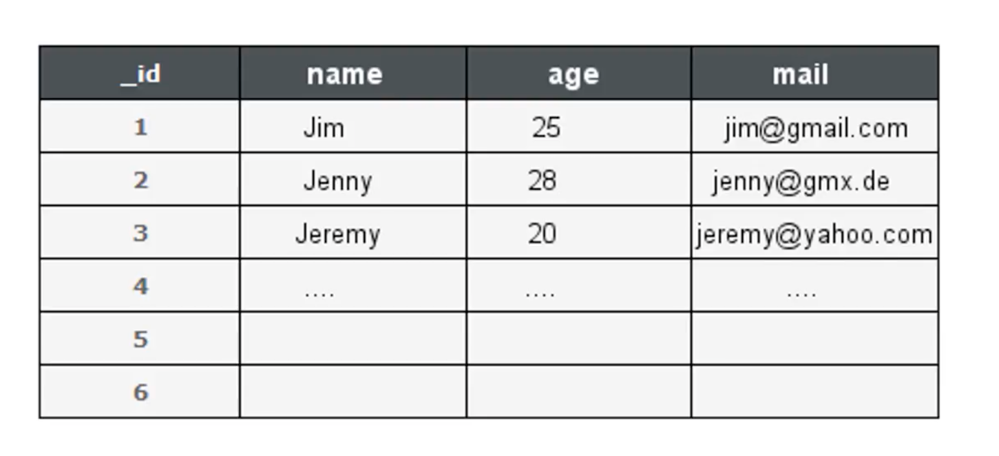
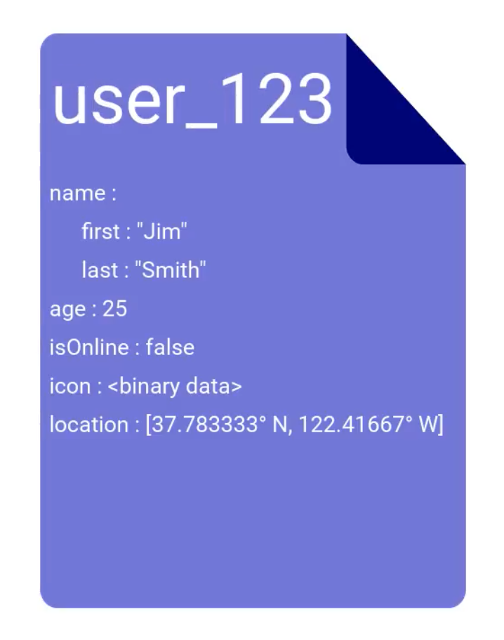
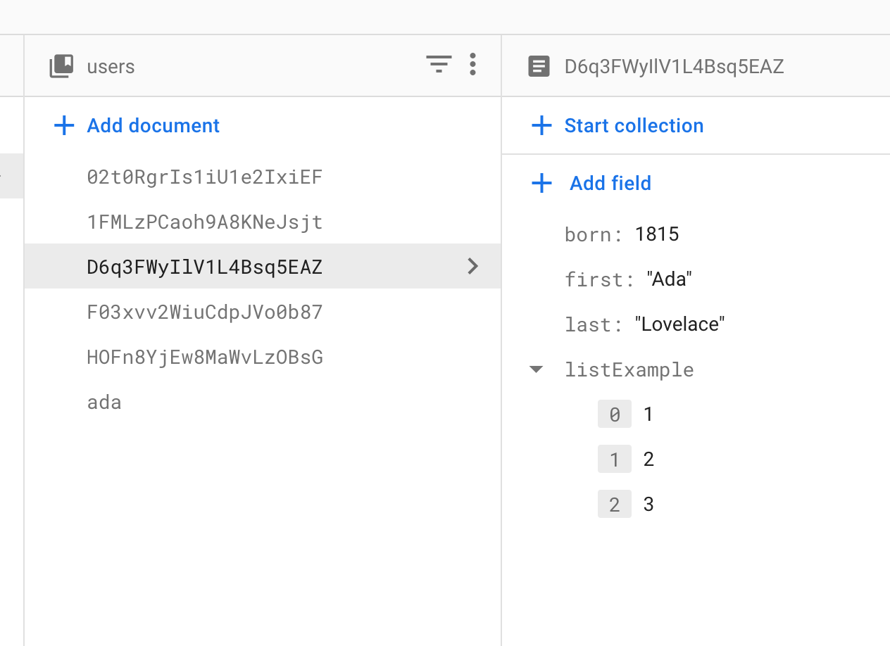

# Firebase Firestore

I kan tage kandidat på RUC. Digital transformation 🎉


## Første tværfaglige projekt

[https://kea-fronter.itslearning.com/LearningToolElement/ViewLearningToolElement.aspx?LearningToolElementId=1110020](https://kea-fronter.itslearning.com/LearningToolElement/ViewLearningToolElement.aspx?LearningToolElementId=1110020)


## Installation

Gå til [Firebase](https://firebase.google.com) og opret en bruger. Efter det skal du oprette et nyt Android projekt. Følg guiden!


1. Lav et nyt Cloud Firestore projekt 
2. opret en ny collection. I de næste eksempler hedder collectionen Users. En collection er som en tabel i sql


📝 Documentation: [https://firebase.google.com/docs/firestore/](https://firebase.google.com/docs/firestore/) (den er virkelig god!)


## Firestore dokument database

Cloud Firestore is a NoSQL, document-oriented database. Unlike a SQL database, there are no tables or rows. Instead, you store data in documents, which are organized into collections.

Data bliver gemt i nestede dokumenter. Det her er ikke en relationel database! Der er ingen relationer, kun dokumenter! Ligesom JSON!

Data bliver gemt i key value pairs. Keys kaldes fields. 

Lad os sige vi har en nyhedsartikel der kan have kommentarer. Gå igennem forskellen i dokument database og relationel database

[https://cloud.google.com/firestore/docs/concepts/structure-data](https://cloud.google.com/firestore/docs/concepts/structure-data)

[https://firebase.google.com/docs/firestore/data-model](https://firebase.google.com/docs/firestore/data-model)


From this:



To this:




## Indsæt data

I firestore er der to måder at indsætte data på


### `.add`

`.add` indsætter bare et nyt dokument og giver dokumentet et tilfældigt id

```java
Map<String, Object> user = new HashMap<>();
user.put("first", "Ada");
user.put("last", "Lovelace");
user.put("born", 1815);
user.put("listExample", Arrays.asList(1, 2, 3));

// Add a new document
db.collection("users")
  .add(user)
  .addOnSuccessListener(new OnSuccessListener<DocumentReference>() {
      @Override
      public void onSuccess(DocumentReference documentReference) {
          System.out.println("added");
      }
  })
  .addOnFailureListener(new OnFailureListener() {
      @Override
      public void onFailure(@NonNull Exception e) {
          System.out.println("error");
          System.out.println(e);
      }
  });
```


The id in the following screenshot is `D6q3FWy...`. The data you can see on the right side




### `.set`

`.set` er lidt anderledes. `.set` kaldes på et dokument. Man laver et nyt dokument sådan her: `.document("ada")`. Her er id'et  `ada `. Vi bestemmer altså id'et. 
`.set` indsætter et nyt dokument hvis det ikke findes. Ellers erstatter det dokumentet med det id!!

```java
Map<String, Object> user = new HashMap<>();
user.put("first", "Ada");
user.put("last", "Lovelace");
user.put("born", 1815);
user.put("listExample", Arrays.asList(1, 2, 3));

// Add a new document with a generated ID
db.collection("users")
  .document("ada")
  .set(user)
  .addOnSuccessListener(new OnSuccessListener<Void>() {
      @Override
      public void onSuccess(Void aVoid) {
          System.out.println("added");
      }
  })
  .addOnFailureListener(new OnFailureListener() {
      @Override
      public void onFailure(@NonNull Exception e) {
          System.out.println("error");
      }
  });
```


### Datatyper

Der findes mange forskellige datatyper 👇

```java
Map<String, Object> docData = new HashMap<>();
docData.put("stringExample", "Hello world!");
docData.put("booleanExample", true);
docData.put("numberExample", 3.14159265);
docData.put("dateExample", new Timestamp(new Date()));
docData.put("listExample", Arrays.asList(1, 2, 3));
docData.put("nullExample", null);
```


### Custom klasser

Man kan gemme custom klasser også

```java
User benjamin = new User("asd", 7);

// Add a new document with a generated ID
db.collection("users")
        .add(benjamin)
        .addOnSuccessListener(new OnSuccessListener<DocumentReference>() {
            @Override
            public void onSuccess(DocumentReference documentReference) {
                System.out.println("added");
            }
        })
        .addOnFailureListener(new OnFailureListener() {
            @Override
            public void onFailure(@NonNull Exception e) {
                System.out.println("error");
                System.out.println(e);
            }
        });
```


**User.java**

```java
package com.example.firebase;

public class User {
    private String name;
    private int age;

    public User(String name, int age) {
        this.name = name;
        this.age = age;
    }

    public String getName() {
        return name;
    }

    public void setName(String name) {
        this.name = name;
    }

    public int getAge() {
        return age;
    }

    public void setAge(int age) {
        this.age = age;
    }
}
```


### Hente data

#### Alle dokumenter i en collection

```java
db.collection("users")
  .get()
  .addOnCompleteListener(new OnCompleteListener<QuerySnapshot>() {
      @Override
      public void onComplete(@NonNull Task<QuerySnapshot> task) {
          if (task.isSuccessful()) {
              for (QueryDocumentSnapshot document : task.getResult()) {
                  System.out.println(document.getData());
              }
          } else {
              System.out.println(task.getException());
          }
      }
  });
```


#### Specifik dokument

```java
db.collection("users")
  .document("ada")
  .get()
```


#### Specifikke dokumenter

```java
db.collection("users")
  .whereEqualTo("first", "ada")
  .get()
```

For flere metoder tjek dokumentationen!


## Installations tips 💡


### Rules fil til når i skal query

Husk at sætte rules til der her inde i Firebase til det her:

```
rules_version = '2';
service cloud.firestore {
  match /databases/{database}/documents {
    match /{document=**} {
      allow read, write: if true;
    }
  }
}
```

This Firestore rule allows 🚨**any user to read and write**🚨 any document in the Firestore database, without any restrictions. 🚨**This configuration is not recommended for production environments, as it could lead to security issues and data leaks**🚨


### Gradle app fil

Jeg havde problemer med Gradle. Prøv det her:


**build.gardle - Project**

```
buildscript {
    dependencies {
        // Add the dependency for the Google services Gradle plugin
        classpath 'com.google.gms:google-services:4.3.15'
    }
}

// Top-level build file where you can add configuration options common to all sub-projects/modules.
plugins {
    id 'com.android.application' version '7.4.2' apply false
    id 'com.android.library' version '7.4.2' apply false
}

```


**build.gradle - App**

```
plugins {
    id 'com.android.application'
    id 'com.google.gms.google-services'
}

android {
    namespace 'com.example.firebase'
    compileSdk 33

    defaultConfig {
        applicationId "com.example.firebase"
        minSdk 24
        targetSdk 33
        versionCode 1
        versionName "1.0"

        testInstrumentationRunner "androidx.test.runner.AndroidJUnitRunner"
    }

    buildTypes {
        release {
            minifyEnabled false
            proguardFiles getDefaultProguardFile('proguard-android-optimize.txt'), 'proguard-rules.pro'
        }
    }
    compileOptions {
        sourceCompatibility JavaVersion.VERSION_1_8
        targetCompatibility JavaVersion.VERSION_1_8
    }
}

dependencies {
    implementation platform('com.google.firebase:firebase-bom:31.2.3')
    implementation 'androidx.appcompat:appcompat:1.6.1'
    implementation 'com.google.android.material:material:1.8.0'
    implementation 'androidx.constraintlayout:constraintlayout:2.1.4'
    implementation 'com.google.firebase:firebase-firestore:24.1.1'
    testImplementation 'junit:junit:4.13.2'
    androidTestImplementation 'androidx.test.ext:junit:1.1.5'
    androidTestImplementation 'androidx.test.espresso:espresso-core:3.5.1'
}
```


## 📝 Note-app

I skal lave en app, hvor brugerne kan skrive og gemme noter. Brugerne skal kunne oprette, opdatere og slette noter. Noterne skal gemmes på Firebase


Noterne skal have en titel, tekst, et tag (fx skole, fodbold, musik). Man skal kunne favorite sin note


I bestemmer UI, layout og interaktion. Overvej at lave papir prototyper


I skal selv læse op på dokumentation mht. at opdatere og slette noter


### Søgning

Man skal kunne søge i appen og finde de noter der matcher hvad en bruger søger på


### Din feature her

Find på en feature her 🎉


