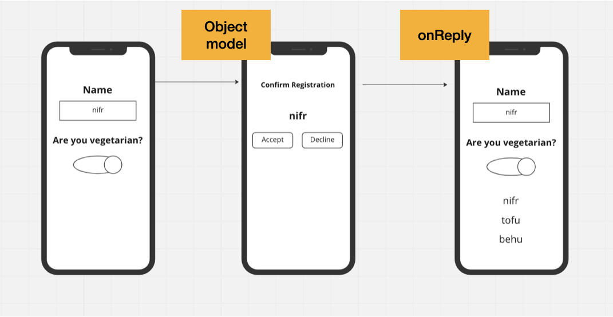
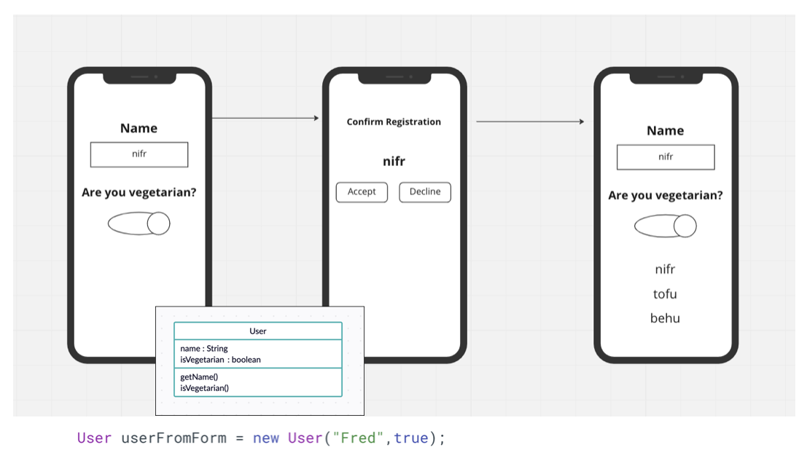
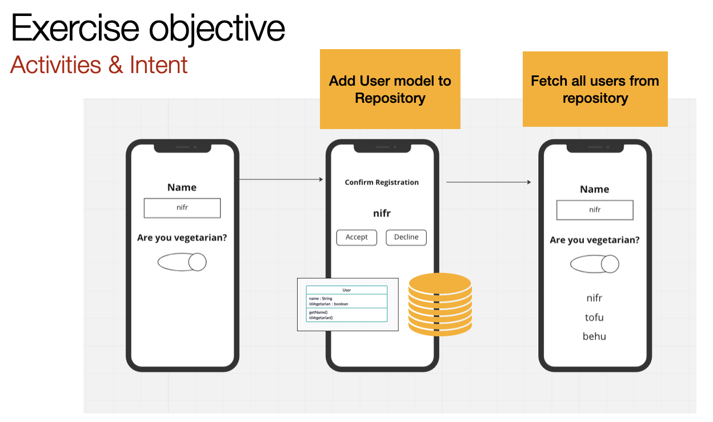

# SavedInstance & object repository

This is a continuation of the module on Activities and intents. If you were not present, you should start with this module: [Activities & Intents](activities-intents.md) 

Optional boilerplate: [Github](https://github.com/nicklasdean/savedInstance-object-repository)

Google Training: [Google](https://developer.android.com/codelabs/android-training-activity-lifecycle-and-state?index=..%2F..%2Fandroid-training#0)







**This exercise mainly concerns functionality - it is not important to style the application**

#### 📝 A)

Rename fields in the boilerplate code such that a user is able to understand the form


#### 📝 B)

Create functionality such that a user is able to:

- Register their name and if they are a vegetarian or not
- The application will add the User to a repository (UserRepository) with an ArrayList that represents a database
  - The User data is passed as a User object which implements the serializable interface

- If the user accepts on a confirmation screen, the user is directed back with a reply

*How to initiate an activity with a callback result*

```java
//Activity started with an intent that expects a reply
startActivityForResult(intent, 1);
```

```java
//RequestCode is sent by the first intent
//resultCode is sent by the second intent
//Data is extras from the second intent reply
@Override
public void onActivityResult(int requestCode, int resultCode, Intent data) {
    super.onActivityResult(requestCode, resultCode, data);
}
```


#### 📝 C) (Advanced) Optional

Expand functionality such that a count of how many vegetarians are registred in the repository is displayed on the MainActivity


#### 📝 D) (Advanced) Optional

When the device is rotated on the MainActivity, the Activity is destroyed and the list is not displayed.

Expand functionality such that: The Activity is restored by using the [savedInstanceAPI](https://developer.android.com/codelabs/android-training-activity-lifecycle-and-state?index=..%2F..%2Fandroid-training#3)


#### 📝 E) (Advanced) Optional

Expand functionality such that a user is **not** able to:

- Register an empty String as name
- Pick a name already in the repository


#### 📝 F) (Advanced) Optional

- Create  **one other** registration option that users can register such as:

  - Invitation Date
  - Address
  - Password

  Choose an element from the palette.

  Research: how to interact with it.
