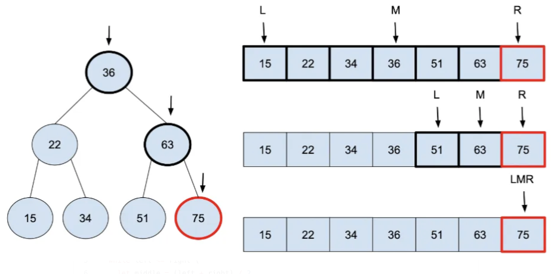

## Linear Search

### First repeating element

Given a list of integers arr[] The task is to find the index of first repeating element in it i.e. the element that occurs more than once and whose index of the first occurrence is the smallest. 

In this exercise you should use a index-based linear data structure such as an array or a list.

**Example:**

```kotlin
val input = arrayOf(10,5,4,6,3,5,3,2);
//Output: 5
//Explaination: 5 is the first repeating element
```


### TwoSum problem

Given an array of integers `nums` and an integer `target`, return *indices of the two numbers such that they add up to `target`*.

You may assume that each input would have ***exactly\* one solution**, and you may not use the *same* element twice.

You can return the answer in any order.

**Example 1:**

```
Input: nums = [2,7,11,15], target = 9
Output: [0,1]
Explanation: Because nums[0] + nums[1] == 9, we return [0, 1].
```

**Example 2:**

```
Input: nums = [3,2,4], target = 6
Output: [1,2]
```

**Example 3:**

```
Input: nums = [3,3], target = 6
Output: [0,1]
```


### Advanced (Optional)

You are an IT company's manager. Based on their performance over the last N working days, you must rate your employee. You are given an array of N integers called workload, where workload[i] represents the number of hours an employee worked on an ith day. The employee must be evaluated using the following criteria:

- Rating = the maximum number of consecutive working days when the employee has worked more than 6 hours.

You are given an integer *N* where *N* represents the number of working days. You are given an integer array *workload* where *workload[i]* represents the number of hours an employee worked on an ith day.

**Task**

Determine the employee rating.

**Example**

*Assumptions*

- *N =* 12
- *workload* = [2, 3, 7, 8, 7, 6, 3, 8, 12, 11, 12, 10]

*Approach*

*Workload* with consecutive hours > 6 = [2, 3, **7, 8, 7**, 6, 3, **8, 12, 11, 12, 10**] => Longest Interval = [8,12,11,12,10]

Therefore return *5*.


## Binary Search

Implement **Binary Search**

''

- You can assume that the array is non-empty.
- You can assume that the array is already sorted.