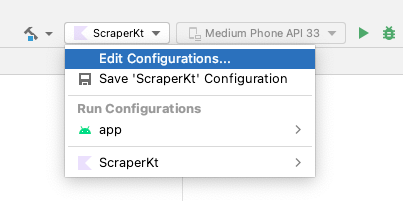
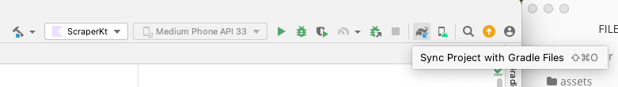
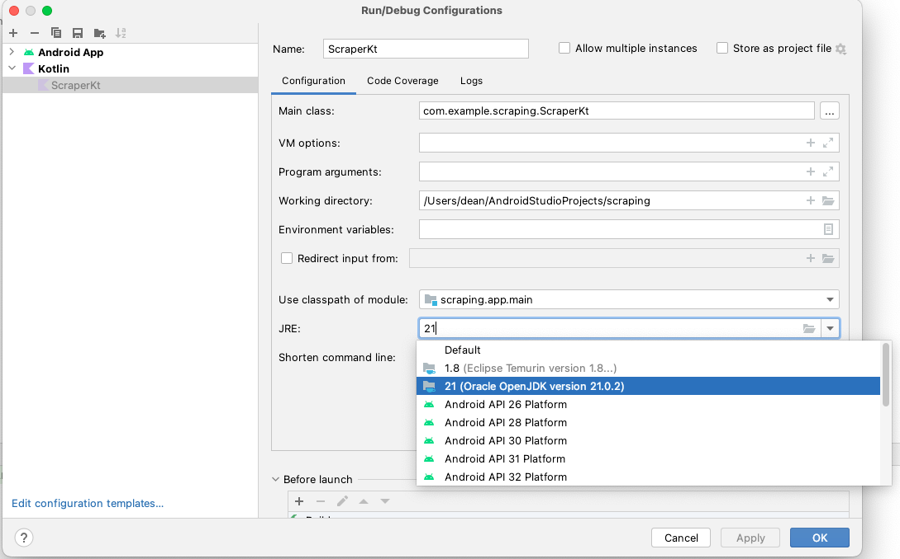
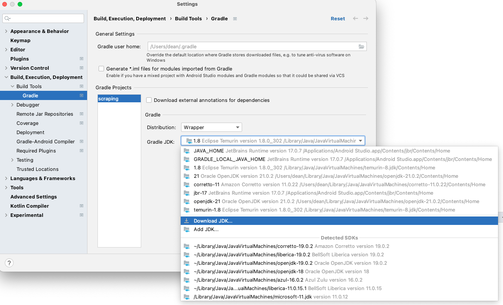
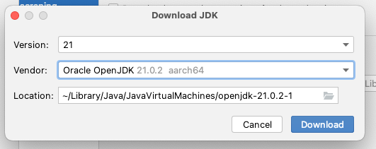

# Web Scraping

In your `build.gradle.kts (Module:app)` file

```kotlin
dependencies {
    implementation("androidx.core:core-ktx:1.12.0")
    implementation("androidx.appcompat:appcompat:1.6.1")
    implementation("com.google.android.material:material:1.11.0")
    testImplementation("junit:junit:4.13.2")
    androidTestImplementation("androidx.test.ext:junit:1.1.5")
    androidTestImplementation("androidx.test.espresso:espresso-core:3.5.1")
    //You should copy the following into your build.gradle.kts file
    implementation("org.seleniumhq.selenium:selenium-java:4.18.1")
}
```


 

**"Sync now" dialogue or press the Gradle sync button**






**IF YOU <u>DO NOT</u> HAVE JRE 21**

**Settings > Build, Execution, Deployment > Build tools > Gradle > Gradle JDK > Download JDK**






# Static pages exercise

Xpath "cheatsheet": https://devhints.io/xpath

Selenium API documentation: https://www.selenium.dev/documentation/webdriver/


**A)**

- Make a list of Strings containing the titles of the first 30 Hackernews posts


**B)**

- Make a data class called HackerNewsPost containing the properties: 
  - Title
  - Link
  - Points
  - Number of comments
- Make the class comparable such that the class can be sorted in a list by comments (Most comments first)

```kotlin
data class HackernewsPost(val title: String, val numberOfComments: Int): Comparable<HackernewsPost> {
    override fun compareTo(other: HackernewsPost): Int {
        TODO("Not yet implemented")
    }
};
```


**C)** **Advanced**

- Write the results to an excel file using the apache POI library
  - Add the following dependencies:

```kotlin
    //Excel gradle dependency
    implementation("org.apache.poi:poi:5.2.3")
    // https://mvnrepository.com/artifact/org.apache.poi/poi-ooxml
    implementation("org.apache.poi:poi-ooxml:5.2.5")
```

**Excample usage of the library**

```kotlin
fun main(){
    val xlWb = XSSFWorkbook()
    val xlWs = xlWb.createSheet()

    val rowNumber = 0
    val columnNumber = 0

    val list1 = arrayListOf<String>("1","2","3");
    val list2 = arrayListOf<String>("et","to","tre");

    for (i in list1.indices){
        val row: Row = xlWs.createRow(i);
        row.createCell(0).setCellValue(list1[i]);
        row.createCell(1).setCellValue(list2[i]);
    }


    val outputStream = FileOutputStream("app/src/main/java/com/example/scraping/text.xlsx")
    xlWb.write(outputStream)
    xlWb.close()
}
```


**D) Advanced**

- Scrape every comment on the first 30 news on hackernews

```kotlin
//Hint: driver.get() takes a String litteral as argument
//It can be replaced with other strings e.g. in a loop
driver.get("https://www.hackernews.com");
```

